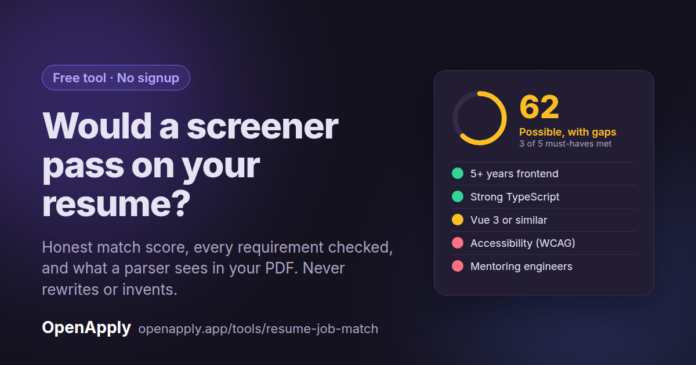

# OpenApply

[](LICENSE)
[](https://github.com/SergeyKhval/OpenApply/actions/workflows/pr-checks.yml)
[](https://openapply.app)

Open, self-hostable, AI-powered job search assistant. Paste a job link, track every application, and get AI resume reviews and tailored cover letters, without paying for one of the closed SaaS trackers.

## Try it free, no signup

**[Check your resume against a job description →](https://openapply.app/tools/resume-job-match?utm_source=github&utm_medium=readme&utm_campaign=sprint-2609&utm_content=readme)**

Paste your resume and a job posting and get an honest match score, every requirement checked against your resume with the line that proves it, the keywords you're missing, and what a parser actually sees in your PDF. It never rewrites your resume or invents experience, and the full prompt behind it is shown on the page so you can run it yourself in any AI chat.



## Features

- Free resume vs job description match checker (no signup)
- AI resume reviews and tailored cover letters
- Job application tracking
- Interview / contact management
- One click link-based or CSV job import
- Resume storage

## Prerequisites

- Node.js v20+
- pnpm v10.16.1+
- Firebase CLI: `npm install -g firebase-tools`
- Firebase account with project created

## Setup

### 1. Clone and Install

```bash
git clone https://github.com/SergeyKhval/OpenApply.git
cd openapply
pnpm install
```

### 2. Firebase Configuration

Create a Firebase project and enable:
- Authentication (Email/Password)
- Firestore Database
- Storage

Get your config from Firebase Console → Project Settings → Your apps → Web app.

### 3. Environment Variables

```bash
cp spa/.env.example spa/.env.local
```

Update `spa/.env.local`:
```env
VITE_BASE_URL=/app
VITE_FIREBASE_API_KEY=your-api-key
VITE_FIREBASE_AUTH_DOMAIN=your-auth-domain
VITE_FIREBASE_PROJECT_ID=your-project-id
VITE_FIREBASE_STORAGE_BUCKET=your-storage-bucket
VITE_FIREBASE_MESSAGING_SENDER_ID=your-sender-id
VITE_FIREBASE_APP_ID=your-app-id

# Optional - leave empty to disable
VITE_POSTHOG_KEY=
VITE_POSTHOG_HOST=
```

### 4. Firebase Project Setup

Create `.firebaserc`:
```json
{
  "projects": {
    "default": "your-firebase-project-id"
  }
}
```

```bash
firebase login
```

### 5. Firebase Emulators (Optional)

```bash
firebase init emulators  # Select: Firestore, Auth, Storage, Functions
firebase emulators:start
```

## Running Locally

### Vue App
```bash
cd spa && pnpm dev  # http://localhost:5173
```

### Landing Page (Optional)
```bash
cd astro && pnpm dev  # http://localhost:4321
```

### Firebase Functions (Optional - AI Features)

For AI features, add Gemini API key:

```bash
cd functions
cp .env.example .env
# Add GEMINI_API_KEY=AIza... to .env
# optionally add Stripe and Resend keys
firebase emulators:start --only functions
```

## Commands

### Vue SPA
```bash
cd spa
pnpm dev         # Development server
pnpm type-check  # Type checking
pnpm build       # Production build
pnpm preview     # Preview build
```

### Astro Landing
```bash
cd astro
pnpm dev      # Development server
pnpm build    # Production build
pnpm preview  # Preview build
```

## License

MIT
